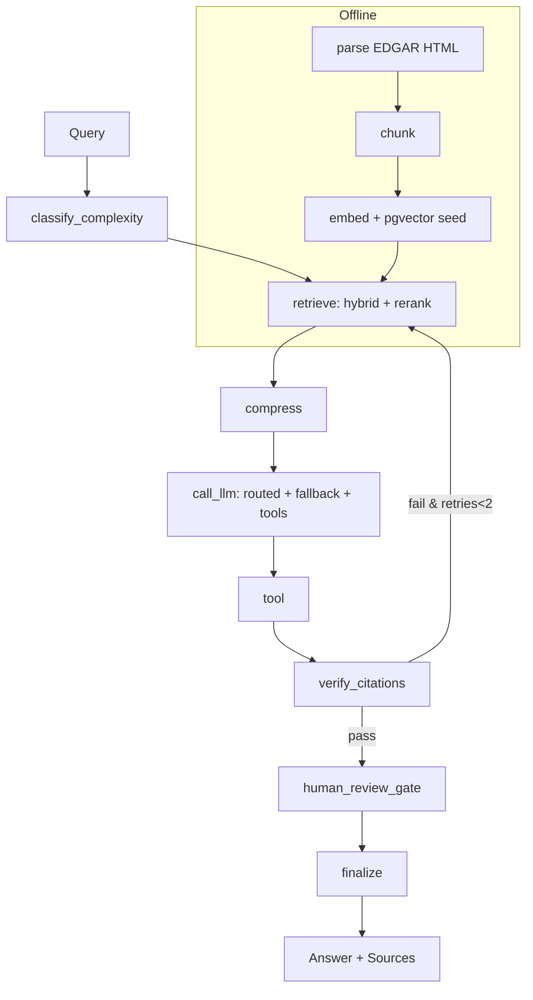

# FinSight — Financial Filings RAG

RAG assistant for SEC 10-K/10-Q filings. Answers are grounded in retrieved passages, with citations, tool-augmented live data, and human-in-the-loop for investment advice.

## FinSight currently focuses on:

- Item 1   Business-
- Item 1A  Risk Factors
- Item 7   Management's Discussion and Analysis
- Item 8   Financial Statements
- Item 7A  Market Risk

## Workflow



**Offline (ingestion):** `data/*.html` → `parse_edgar_file` (Item 1A, Item 7) → `chunk_document` (1000/150, metadata) → `embed_chunks` (sentence-transformers, 384d) → `pgvector`.

**Online (graph):** `ask()` builds state, runs graph, returns answer with citations.

## State

`GraphState` (TypedDict) flows through nodes:

| Field | Type | Purpose |
|---|---|---|
| `query` | `str` | User question |
| `k` | `int` | Top-k to retrieve |
| `tier` | `simple\|normal\|complex` | From classifier |
| `chunks` | `list[dict]` | Retrieved + compressed chunks |
| `answer` / `draft_answer` | `str` | Final / draft answer |
| `provider` | `str` | LLM provider that served |
| `tokens_in` | `int` | Prompt tokens |
| `sources` | `list[str]` | Distinct chunk sources |
| `tool_results` | `list[dict]` | Tool outputs |
| `verification` | `dict` | `passed`, `failed_claims`, `verified_claims` |
| `verification_retries` | `int` | Bounded retry count (max 2) |
| `is_recommendation` | `bool` | HITL trigger |
| `hitl_approved` | `bool\|None` | Human decision |
| `error` | `str\|None` | Degraded mode |

## Tools

LangChain tools bound to the LLM (also callable directly):

- `get_stock_price(ticker)` — `yfinance` live price, returns `{ticker, price, currency, as_of}` validated by `TickerPriceResponse`
- `calculate_pe_ratio(price, eps)` — `price / eps`
- `calculate_gross_margin(revenue, gross_profit)` — `gross_profit / revenue`
- `calculate_growth_rate(current, previous)` — `(current-previous)/previous`

All return `RatioResult` (Pydantic) with `value`, `numerator`, `denominator`, `formula`. The `tool` node auto-handles P/E queries: fetches live price, extracts EPS from chunks, computes ratio, appends `[Tool-augmented: ...]`.

## Packages

| Layer | Package | Use |
|---|---|---|
| Orchestration | `langgraph`, `langchain` | Graph, state, tools |
| LLM | `langchain-groq`, `langchain-openai`, `langchain-google-genai`, `openai` | Providers + fallback |
| Embeddings | `sentence-transformers` | Local 384d embeddings |
| Rerank | `sentence-transformers` | `cross-encoder/ms-marco-MiniLM-L-6-v2` |
| Vector store | `pgvector`, `sqlalchemy`, `psycopg2-binary` | Postgres pgvector |
| Retrieval | `rank-bm25` | Lexical search |
| Parsing | `beautifulsoup4`, `lxml`, `html5lib` | EDGAR HTML |
| Tokens | `tiktoken` | Budget counting |
| Cache/State | `redis` | Embedding cache, checkpoint (fallback to memory) |
| Finance | `yfinance` | Live prices |
| Validation | `pydantic`, `pydantic-settings` | Config & schemas |
| Eval | `ragas` | Metrics (heuristic fallback if import fails) |

## Setup

```bash
python -m venv .venv && source .venv/bin/activate
pip install -e .
cp .env.example .env  # add GROQ_API_KEY, OPENAI_API_KEY, postgres URL
# Postgres + pgvector required (e.g., docker)
python -m src.ingestion --preview 2
python -m src.retrieval seed
```

## Usage

```bash
# Retrieval
python -m src.retrieval search "what are the main risks" --k 5
python -m src.retrieval hybrid "total net sales 383.3 billion" --k 5
python -m src.retrieval rerank "liquidity 148.3 billion" --k 5

# LLM (single call)
python -m src.llm answer "what are the main risks" --k 5

# Full graph (routing + fallback + tools + verification + HITL)
python -m src.graph ask "what was Apple's total net sales in fiscal 2023" --k 5
python -m src.graph ask "What's the current P/E ratio for AAPL given the latest filing?" --k 5
python -m src.graph ask "Build a bull and bear case for AAPL, should I invest?" --k 5

# Evaluation (heuristic RAGAS + custom judge)
python -m src.eval --limit 5
cat data/eval/baseline.json
```

Routing: `simple`→`openai/gpt-oss-20b`, `normal`→`qwen/qwen3.6-27b`, `complex`→`openai/gpt-oss-120b` (all via Groq). Override via `MODEL_ROUTING_<TIER>_MODEL_NAME`.

Fallback: `openai → groq → gemini → vllm`, logs `Served by provider=... model=... tier=...`.

## Evaluation

Dataset `data/eval/eval_dataset.json` (30 Q/A, 3 tiers, 4 recommendations). Metrics: `context_precision`, `context_recall`, `faithfulness`, `answer_relevance` (heuristic, 0-1) + custom numeric judge (LLM with heuristic fallback). Run `python -m src.eval` to regenerate `data/eval/baseline.json`.

## Caching

`src/retrieval/cache.py` caches query/chunk embeddings by `model::text` hash in Redis (TTL 1h) with in-memory fallback. Repeated queries hit cache → faster.

Checkpointer: `src/graph/checkpoint.py` tries `RedisSaver` when `checkpointer_type=redis` and Redis reachable, else `MemorySaver` (logs fallback). Enables HITL state to survive restarts when Redis is available.

## Future Scope

To extend functionality and make FinSight more robust, production-ready, and finance-grade:

### 1. Data & Ingestion Expansion
- **Automated EDGAR ingestion:** Scheduled crawler with proper `User-Agent`, throttling, and incremental sync for 10-K / 10-Q / 8-K / Proxy (DEF 14A) instead of manual HTML drops.
- **XBRL-first + table-aware parsing:** Parse XBRL for financial tables (Income Statement, Balance Sheet) preserving rows/columns; HTML fallback with `lxml`/`html5lib` for narrative sections.
- **Broader corpus:** Earnings call transcripts, investor presentations (PDF), press releases, and international filings (IFRS). Keep source documents read-only; write derived chunks/embeddings to separate storage.
- **Smarter chunking:** Structure-aware chunking — never split tables mid-row or sentences mid-clause; overlap tuning per section (e.g., Item 1A vs Item 8).

### 2. Retrieval & Reasoning
- **Metadata-filtered retrieval:** Pre-filter by `ticker`, `filing_type`, `fiscal_period`, `section` before dense/BM25 search.
- **Advanced retrieval:** Query rewriting / HyDE, multi-hop retrieval for cross-filing comparison, and parent-document retrieval to keep citations + full context.
- **Improved rerank & compress:** Benchmark additional cross-encoders, LLM-based compression with token-budget enforcement via `tiktoken`.
- **Graph refinements:** Explicit LangGraph nodes for `retrieve_dense` / `retrieve_bm25` / `fuse_hybrid` / `rerank` as separate steps (per PRD §3.2) with bounded retry on `verify_citations` failure.

### 3. Live Data & Tooling
- **More finance tools:** SEC EDGAR API lookup, historical price windows, DCF / ratio suite (ROE, debt-to-equity, FCF), and XBRL numeric extraction with Pydantic-validated schemas.
- **Streaming market data:** Optional WebSocket price feed for intra-day queries without blocking the RAG path.

### 4. Trust, Safety & Compliance
- **Stronger verification:** NLI-based claim-to-chunk entailment (beyond substring checks) + numeric claim normalization ($M vs $B) — failed verification surfaces as flagged/degraded response.
- **HITL hardening:** Stricter `is_recommendation` classifier, audit log for approvals/rejections, LangGraph `interrupt` with Redis checkpoint surviving restarts.
- **Guardrails:** Investment-advice disclaimer, hallucination rate SLOs, and refusal path for unverifiable queries.

### 5. Evaluation & Quality
- **Larger eval set:** Grow from 30 to 100+ Q/A with peer-comparison and temporal queries; freeze versioned eval snapshots.
- **Full RAGAS + custom judge:** Faithfulness, context precision/recall, answer relevance plus numeric-citation judge with LLM + deterministic fallback.
- **Regression harness:** `python -m src.eval` in CI to block pipeline changes that drop scores; track cost/latency per query tier.

### 6. Robustness & Performance
- **Caching & resilience:** Redis cache for embeddings + prompts (TTL 1h) with in-memory fallback; circuit breakers around LLM providers; complete `OpenAI → Groq → Gemini → local vLLM` fallback with logged reasons.
- **Latency & cost tracking:** Per-query token accounting, routing accuracy metrics (≥90% simple→cheap), and budget alerts.
- **Error handling:** No bare `except:`; specific handling for timeout/429/auth; no silent swallow of verification errors.

### 7. Observability & MLOps 
- **LGTM stack:** Loki + Grafana + Tempo + Mimir/Prometheus for traces/metrics/logs per provider/tier.
- **Model/prompt versioning & cost dashboards.**
- **Automated eval on every retrieval/LLM change.**

### 8. Deployment & UX
- **API + UI:** FastAPI service + Streamlit/Next.js chat UI with inline citation highlighting, source preview, and exportable research briefs.
- **Deployment:** Dockerized Postgres+pgvector & Redis via `docker-compose.yml`; AWS infra-as-code (deferred until Phase 2).
- **Multi-turn memory:** Conversational follow-ups with query context carry-over.

## Project Structure

```
src/
  config.py          # Settings
  routing.py         # Complexity classifier
  tokens.py          # Token counting
  ingestion/         # parse + chunk
  retrieval/         # embed, bm25, hybrid, rerank, compress, cache, storage
  llm/               # prompt, client, fallback, tools, answer
  tools/             # price, ratios, schemas
  verification/      # citation grounding
  hitl/              # recommendation gate
  graph/             # state, nodes, checkpoint, graph
  eval/              # dataset, metrics, judge, harness
data/
  chunks/            # chunk JSON
  eval/              # eval_dataset.json, baseline.json
```
