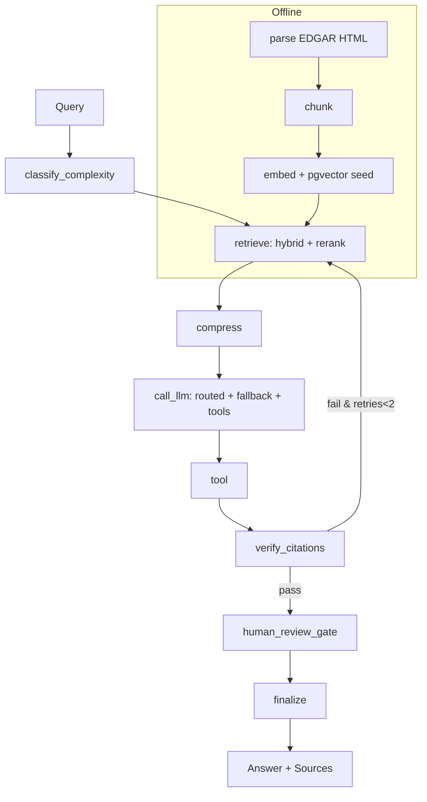

# FinSight — Financial Filings RAG

RAG assistant for SEC 10-K/10-Q filings. Answers are grounded in retrieved passages, with citations, tool-augmented live data, and human-in-the-loop for investment advice.

## Workflow



**Offline (ingestion):** `data/*.html` → `parse_edgar_file` (Item 1A, Item 7) → `chunk_document` (1000/150, metadata) → `embed_chunks` (sentence-transformers, 384d) → `pgvector`.

**Online (graph):** `ask()` builds state, runs graph, returns answer with citations.

## State

`GraphState` (TypedDict) flows through nodes:

| Field | Type | Purpose |
|---|---|---|
| `query` | `str` | User question |
| `k` | `int` | Top-k to retrieve |
| `tier` | `simple\|normal\|complex` | From classifier |
| `chunks` | `list[dict]` | Retrieved + compressed chunks |
| `answer` / `draft_answer` | `str` | Final / draft answer |
| `provider` | `str` | LLM provider that served |
| `tokens_in` | `int` | Prompt tokens |
| `sources` | `list[str]` | Distinct chunk sources |
| `tool_results` | `list[dict]` | Tool outputs |
| `verification` | `dict` | `passed`, `failed_claims`, `verified_claims` |
| `verification_retries` | `int` | Bounded retry count (max 2) |
| `is_recommendation` | `bool` | HITL trigger |
| `hitl_approved` | `bool\|None` | Human decision |
| `error` | `str\|None` | Degraded mode |

## Tools

LangChain tools bound to the LLM (also callable directly):

- `get_stock_price(ticker)` — `yfinance` live price, returns `{ticker, price, currency, as_of}` validated by `TickerPriceResponse`
- `calculate_pe_ratio(price, eps)` — `price / eps`
- `calculate_gross_margin(revenue, gross_profit)` — `gross_profit / revenue`
- `calculate_growth_rate(current, previous)` — `(current-previous)/previous`

All return `RatioResult` (Pydantic) with `value`, `numerator`, `denominator`, `formula`. The `tool` node auto-handles P/E queries: fetches live price, extracts EPS from chunks, computes ratio, appends `[Tool-augmented: ...]`.

## Packages

| Layer | Package | Use |
|---|---|---|
| Orchestration | `langgraph`, `langchain` | Graph, state, tools |
| LLM | `langchain-groq`, `langchain-openai`, `langchain-google-genai`, `openai` | Providers + fallback |
| Embeddings | `sentence-transformers` | Local 384d embeddings |
| Rerank | `sentence-transformers` | `cross-encoder/ms-marco-MiniLM-L-6-v2` |
| Vector store | `pgvector`, `sqlalchemy`, `psycopg2-binary` | Postgres pgvector |
| Retrieval | `rank-bm25` | Lexical search |
| Parsing | `beautifulsoup4`, `lxml`, `html5lib` | EDGAR HTML |
| Tokens | `tiktoken` | Budget counting |
| Cache/State | `redis` | Embedding cache, checkpoint (fallback to memory) |
| Finance | `yfinance` | Live prices |
| Validation | `pydantic`, `pydantic-settings` | Config & schemas |
| Eval | `ragas` | Metrics (heuristic fallback if import fails) |

## Setup

```bash
python -m venv .venv && source .venv/bin/activate
pip install -e .
cp .env.example .env  # add GROQ_API_KEY, OPENAI_API_KEY, postgres URL
# Postgres + pgvector required (e.g., docker)
python -m src.ingestion --preview 2
python -m src.retrieval seed
```

## Usage

```bash
# Retrieval
python -m src.retrieval search "what are the main risks" --k 5
python -m src.retrieval hybrid "total net sales 383.3 billion" --k 5
python -m src.retrieval rerank "liquidity 148.3 billion" --k 5

# LLM (single call)
python -m src.llm answer "what are the main risks" --k 5

# Full graph (routing + fallback + tools + verification + HITL)
python -m src.graph ask "what was Apple's total net sales in fiscal 2023" --k 5
python -m src.graph ask "What's the current P/E ratio for AAPL given the latest filing?" --k 5
python -m src.graph ask "Build a bull and bear case for AAPL, should I invest?" --k 5

# Evaluation (heuristic RAGAS + custom judge)
python -m src.eval --limit 5
cat data/eval/baseline.json
```

Routing: `simple`→`openai/gpt-oss-20b`, `normal`→`qwen/qwen3.6-27b`, `complex`→`openai/gpt-oss-120b` (all via Groq). Override via `MODEL_ROUTING_<TIER>_MODEL_NAME`.

Fallback: `openai → groq → gemini → vllm`, logs `Served by provider=... model=... tier=...`.

## Evaluation

Dataset `data/eval/eval_dataset.json` (30 Q/A, 3 tiers, 4 recommendations). Metrics: `context_precision`, `context_recall`, `faithfulness`, `answer_relevance` (heuristic, 0-1) + custom numeric judge (LLM with heuristic fallback). Run `python -m src.eval` to regenerate `data/eval/baseline.json`.

## Caching

`src/retrieval/cache.py` caches query/chunk embeddings by `model::text` hash in Redis (TTL 1h) with in-memory fallback. Repeated queries hit cache → faster.

Checkpointer: `src/graph/checkpoint.py` tries `RedisSaver` when `checkpointer_type=redis` and Redis reachable, else `MemorySaver` (logs fallback). Enables HITL state to survive restarts when Redis is available.

## Project Structure

```
src/
  config.py          # Settings
  routing.py         # Complexity classifier
  tokens.py          # Token counting
  ingestion/         # parse + chunk
  retrieval/         # embed, bm25, hybrid, rerank, compress, cache, storage
  llm/               # prompt, client, fallback, tools, answer
  tools/             # price, ratios, schemas
  verification/      # citation grounding
  hitl/              # recommendation gate
  graph/             # state, nodes, checkpoint, graph
  eval/              # dataset, metrics, judge, harness
data/
  chunks/            # chunk JSON
  eval/              # eval_dataset.json, baseline.json
```
